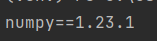

# [COMPSCI235] Lab report 1

## Virtual Environment
Running the project in virtual environment, it is easy to control the versions and packages of every isolated project. Those packages will not collide with other project.

1. A virtual environment will be created once open a new project. One venv per project. 

2. After create a New Project called `HelloWorld`. We can see there is `main.py`. 


3. Click on terminal we can enter the various commands. We import the numpy packages by typing `pip install numpy`.         


4. Waiting for few seconds, it will show  the info of package when installing, and installation succeed message.

5. After installation, numpy package is under the directry of `venv>lib> site-package `


### Generate requirements.txt file
-   To generate the requirements.txt file by insesrt the below commands:    

- It will show the info     



## Debug
By running the code and setting break point, Guessing game is easily to explore the debugging features of PyCharm.  
```
Question 1: 
What is the probability of winning a game? 
```
- Once start running the code, the console will prompt to insert a number between `1-100`, therefore it shows the probability of winning a game is `1/100`.

```
Question 2: 
Using the debugging feature, WITHOUT changing any code, it is possible to win every game. What line did you insert the breakpoint at?
```
- To win this game, the key is find out the code which holding the answer.

- The line 39 will return the correct number. Therefore we can set the breakpoint in line 39.      


- Using the debugger, run the code, it will stop at line 39. The debugger will show the return number, remember this number, and keep pressing `step over` till the console prompts to insert number. 

- Insert `74` and win the game.             


- By repeating these steps, it is possible to **WIN** every game.


```
Question 3: 
Using the debugging feature only, is it possible the user can win every game by guessing "42"?
```
- Obviously, it is **NOT** possible to win, since the debug feature cannot affect the random number that the program generates, it is only possible to get the correct answer.


## GitHub

[Here](https://github.com/wcho494/Compsci235_LabReport) is the repository of Compsci235LabReport from GitHub.
```
https://github.com/wcho494/Compsci235_LabReport
```